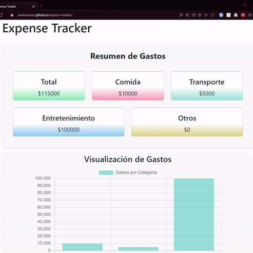

# Expense Tracker Application

Esta es una aplicación de seguimiento de gastos que incluye un frontend y un backend desarrollados en React con TypeScript y Node.js con TypeScript. La aplicación permite a los usuarios agregar, editar, eliminar y ver gastos, y también proporciona gráficos y resúmenes de gastos por categoría. La información de los gastos es añadida en un servidor de prueba creado con Render.com

La aplicación está dividida en dos partes:

- **Frontend (React con TypeScript )**: Proporciona la interfaz de usuario donde los usuarios pueden gestionar sus gastos.
- **Backend (Node.js con TypeScript)**: Proporciona una API REST para manejar las operaciones CRUD de los gastos y está desplegado en Render.com.

    


### Enlaces importantes

- **Aplicación desplegada (Frontend)**: [Expense Tracker Frontend en GitHub Pages](https://andrezmazo.github.io/expense-tracker/)
- **API desplegada (Backend)**: [Expense Tracker SERVER en Render](https://expense-tracker-server-h04m.onrender.com/api/expenses)
- **Repositorio Frontend en GitHub**: [Expense Tracker](https://github.com/andrezmazo/expense-tracker.git)
- **Repositorio Backend en GitHub**: [Expense Tracker SERVER ](https://github.com/andrezmazo/expense-tracker-SERVER.git)

## Características

- **Agregar gastos**: Permite a los usuarios agregar nuevos gastos con detalles como monto, categoría, fecha y descripción.
- **Editar gastos**: Modificar gastos existentes.
- **Eliminar gastos**: Eliminar gastos del registro.
- **Visualización de gastos**: Ver la lista de gastos , totales y gráficos que resumen los gastos por categoría.
- **Filtros**: Filtrar los gastos por categoría y fechas.
- **Responsive Design**: Adaptable a diferentes tipos de resoluciones.

## Despliegue

* **Frontend** : Desplegado en GitHub Pages.
* **Backend** : Desplegado en Render.com.

La aplicación actualmente se encuentra desplegada en [Expense Tracker Frontend en GitHub Pages](https://andrezmazo.github.io/expense-tracker/) para su prueba de funcionamientos.
Para la configuración local seguir los pasos acontinuación

**Importante:** El almacenamiento de los valores se dara 50 segundos luego de cargar la pagina dado el funcionamiento de las instancias gratis en [render.com](https://docs.render.com/free)

## Requisitos previos

Asegúrate de tener instalados los siguientes programas:

- [Node.js](https://nodejs.org/) (v14.x o superior)
- [npm](https://www.npmjs.com/) o [Yarn](https://yarnpkg.com/)

## Pasos de instalación y ejecución

### 1. Clonar los repositorios

Clona los repositorios de GitHub para el frontend y backend:

```bash
# Clonar el repositorio del frontend
git clone https://github.com/andrezmazo/expense-tracker.git

# Clonar el repositorio del backend
git clone https://github.com/andrezmazo/expense-tracker-SERVER.git
```

### 2. Configurar el Frontend

Accede al directorio del proyecto del frontend y sigue los pasos:

```
cd expense-tracker
npm install  
```

### 3. Configurar el Backend

Accede al directorio del proyecto del backend y sigue los pasos:

```
cd expense-tracker-SERVER
npm install
```

### 4. Ejecutar la aplicación localmente

#### Ejecutar el Backend

```
cd expense-tracker-SERVER
npm start
```

El backend estará disponible en `http://localhost:5000`.

#### Ejecutar el Frontend

```
cd expense-tracker
npm start  # o yarn start
```

La aplicación estará disponible en `http://localhost:3000`.

## Funcionamiento

* **Agregar un nuevo gasto** : Rellena el formulario de gastos, envíalo y se agregara un gasto a la lista.
* **Vizualización de suma de gastos por categoría:** Permite la vizualización del total y suma por categoría
* **Ver gráficos** : La aplicación muestra un gráfico de barras con los gastos por categoría.
* **Listado de gastos:** Permite la vizualización de todos los gastos añadidos con sus correspondientes columnas de monto, categoría, fecha, descripción (Opcional) y botones de acción.
* **Editar un gasto** : Selecciona un gasto existente y modifícalo.
* **Eliminar un gasto** : Haz clic en el botón de eliminar asociado a un gasto.
* **Filtros** : Filtra los gastos por categoría y fechas para ver resultados específicos.

## Autoría

Desarrollado por **Andrés Zapata Mazo**, espero sea de su agrado! **:)**
